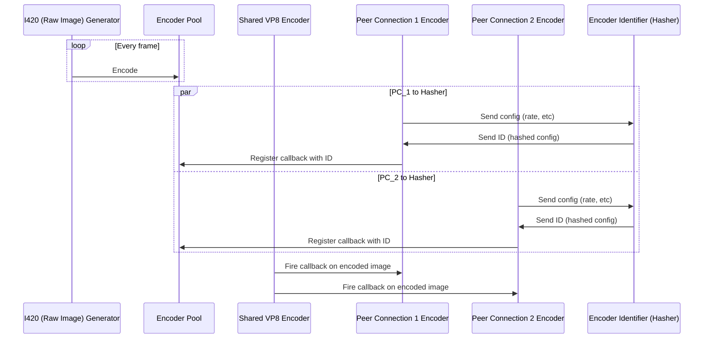

# Reactive Encoding

Reactive encoder and the encoder pool work together to share encoded frames between multiple peer connections for the purpose of generating load.

```mermaid
sequenceDiagram
    participant Image as I420 (Raw Image) Generator 
    participant EncoderPool as Encoder Pool
    participant SharedVP8Encoder as Shared VP8 Encoder
    participant PC_1 as Peer Connection 1 Encoder
    participant PC_2 as  Peer Connection 2 Encoder
    participant Hasher as Encoder Identifier (Hasher)
    loop Every frame
        Image->>EncoderPool: Encode 
    end
    par PC_1 to Hasher
        PC_1->>Hasher: Send config (rate, etc) 
        Hasher->>PC_1: Send ID (hashed config)
        PC_1->>EncoderPool: Register callback with ID
    and PC_2 to Hasher
        PC_2->>Hasher: Send config (rate, etc)
        Hasher->>PC_2: Send ID (hashed config)
        PC_2->>EncoderPool: Register callback with ID
    end
    SharedVP8Encoder->>PC_1: Fire callback on encoded image
    SharedVP8Encoder->>PC_2: Fire callback on encoded image 
```